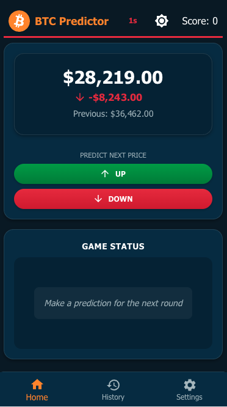

# Bitcoin Predictor

A web application that allows users to predict Bitcoin price movements in a fun and interactive way.

## Overview

Bitcoin Predictor is a React-based web application that simulates Bitcoin price movements and lets users make predictions about whether the price will go up or down. Users earn points for correct predictions and lose points for incorrect ones.



## Features

- **Price Prediction Game**: Make predictions on whether the Bitcoin price will go up or down
- **Score Tracking**: Keep track of your prediction accuracy with a scoring system
- **Price History Chart**: Visualize Bitcoin price movements over time
- **Prediction History**: Review your past predictions and their outcomes
- **Responsive Design**: Optimized for both desktop and mobile devices
- **Theme Support**: Light and dark themes for better user experience
- **Customizable Settings**: Configure refresh intervals and other application settings

## Getting Started

### Prerequisites


### Installation

1. Clone the repository:
   ```bash
   git clone https://github.com/yourusername/btc-predictor.git
   cd btc-predictor
   ```

2. Install dependencies:
   ```bash
   nvm use
   npm install
   ```

### Running the Application

To start the development server:

```bash
npm run dev
```

This will start the application in development mode. Open [http://localhost:5173](http://localhost:5173) to view it in your browser.

## Usage

1. **Making Predictions**:
   - On the home screen, you'll see the current Bitcoin price
   - Use the "UP" or "DOWN" buttons to predict the next price movement
   - Wait for the next price update to see if your prediction was correct


2. **Viewing History**:
   - Navigate to the History tab to see your prediction history and price chart
   - The chart shows price movements over time with your predictions marked


3. **Adjusting Settings**:
   - Go to the Settings tab to customize the application
   - Adjust the refresh timer to change how frequently the price updates
   - Use keyboard shortcuts (P to pause/resume, M to manually refresh when paused)

## Building for Production

To build the application for production:

```bash
npm run build
```

This will generate optimized production files in the `dist` directory.

To preview the production build locally:

```bash
npm run preview
```


## Development Notes

- The application currently uses simulated Bitcoin price data with random values
- Due to time constraints, the project structure is simplified and no tests are included

### Upcoming Features
- Integration with real Bitcoin price APIs for live data
- User authentication to save individual scores and settings
- Leaderboard to compare scores with other users
- Game statistics like win/loss ratio, biggest streak, games played etc.
- Rules and instructions or a tutorial for new users

### Keyboard Shortcuts

- **P**: Pause/Resume Bitcoin price updates
- **M**: Manually refresh Bitcoin price (when paused)

## License

This project is licensed under the MIT License - see the LICENSE file for details.

## Author

Josef Mögelin
